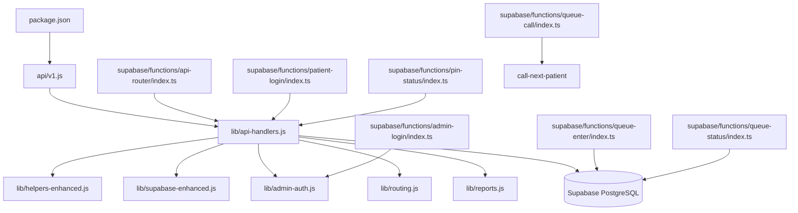

# Backend Architecture

## Runtime verification
- `api/v1.js` is the canonical Vercel HTTP entrypoint.
- `lib/api-handlers.js` contains the effective queue, auth, clinic, patient, and report orchestration logic.
- `queue-call/index.ts` is a compatibility wrapper forwarding to `call-next-patient`.
- `queue-status/index.ts` reads directly from canonical `public.queues`.
