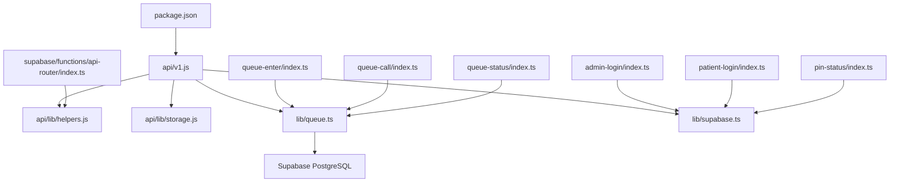

# Backend Architecture

```mermaid
flowchart TB
PKG[package.json] --> V1[api/v1.js]
V1 --> HELPERS[api/lib/helpers.js]
V1 --> STORAGE[api/lib/storage.js]
V1 --> QUEUE[lib/queue.ts]
V1 --> SUPA[lib/supabase.ts]
ROUTER[supabase/functions/api-router/index.ts] --> HELPERS
ADMIN[admin-login/index.ts] --> SUPA
PATIENT[patient-login/index.ts] --> SUPA
PIN[pin-status/index.ts] --> SUPA
ENTER[queue-enter/index.ts] --> QUEUE
CALL[queue-call/index.ts] --> QUEUE
STATUS[queue-status/index.ts] --> QUEUE
QUEUE --> DB[Supabase PostgreSQL]
```
